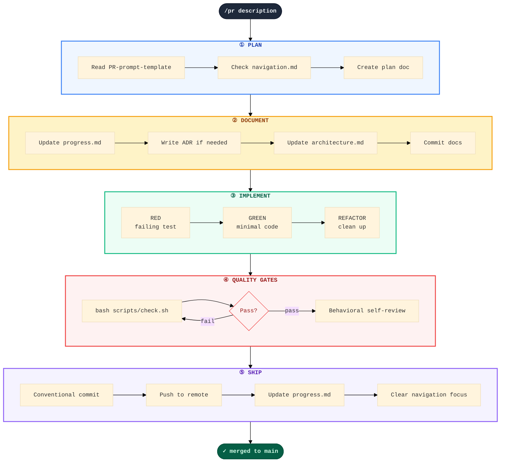

# repo_template

AI-assisted software development workflow in a box. Copy a single file, point an AI at it, and get your project's entire docs infrastructure — templates, quality gates, tracking dashboards, and agent rules — customized to your stack.

## Why

**AI coding tools are fast. Fast without structure is chaos.**

Most AI-assisted projects hit the same wall: the agent produces code quickly, but after a few sessions you lose track of *what was changed*, *why decisions were made*, and *whether anything is actually tested*. Bugs creep in. Context evaporates. Velocity collapses.

This repo gives you the missing layer: **AI-native project infrastructure** that enforces plan-first discipline, automated quality gates, and a living paper trail — without slowing you down.

| Pain | Fix |
|------|-----|
| Agent rewrites things you didn't ask for | `check.sh` grep guards catch debug prints, secrets, TODO cruft |
| No one knows why that architecture choice was made | ADRs auto-generated per decision; linked from progress.md |
| Tests? What tests? | TDD enforced per PR; coverage tracked in progress.md |
| "What happened last session?" | `learnings.md` + `navigation.md` capture every session's key insights |
| PRs drift off-spec | Plan doc created *before* code; behavioral self-review catches scope creep |
| Setting up from scratch is painful | One file (`INSTALL.md`), one sentence — AI auto-detects your stack and generates everything |

**One file. One sentence. Full infrastructure.** No config files to manage. No manual template wrangling. The AI reads your existing `package.json` / `pyproject.toml` / `Cargo.toml` and derives language-specific lint, typecheck, test, and build commands automatically.

## Workflow

### End-to-end overview


### Atomic PR pipeline (every change runs through this)



### Quality gates detail

```
  scripts/check.sh ──►  lint ──►  typecheck ──►  test + coverage ──►  build
                              │
                              ▼
              grep guards:  debug prints  ·  raw env reads  ·  secrets  ·  TODOs
```

### What happens at each phase

| Phase | Goal | Output |
|-------|------|--------|
| **Plan** | Define the change before writing code | `docs/plans/PR{N}-{slug}.md` |
| **Document** | Connect the PR to project context | Updated progress, navigation, ADRs, architecture |
| **Implement** | Build with TDD discipline | RED → GREEN → REFACTOR per component |
| **Quality** | Automated gates + behavioral self-review | All gates green or back to implement |
| **Ship** | Get it into main | Squash merge, branch deleted, docs finalized |

**Language-agnostic**: `scripts/check.sh` auto-configures per stack — lint, typecheck, test+coverage, build, grep guards. 13 languages supported.

## What you get

```
your-project/
├── CLAUDE.md              # Agent rules for Claude Code: plan-first, TDD, quality gates
├── AGENTS.md              # Harness-agnostic agent rules (OpenCode, Cursor, Aider, Codex)
├── docs/
│   ├── index.md            # Docs entrypoint
│   ├── quickstart.md       # 5-minute setup guide
│   ├── architecture.md     # System design + tech stack + scaling model
│   ├── contributing.md     # Setup, conventions, PR workflow
│   ├── code-review.md      # 4-phase review checklist with auto-reject triggers
│   ├── testing.md          # Testing guide, anti-pattern catalog, coverage targets
│   ├── PR-template.md      # Canonical PR workflow with enforcement gates
│   ├── navigation.md       # Session protocol, task map, scout corrections
│   ├── archive/
│   │   └── learnings.md    # Accumulated project knowledge
│   ├── decisions/
│   │   └── YYYY-MM-DD-decision-template.md   # Architecture Decision Record template
│   ├── plans/
│   │   ├── progress.md     # Master tracking: PRs, pipeline, quality, sessions
│   │   ├── phase-plan-template.md            # Phase plan template
│   │   └── PR-prompt-template.md             # Single-PR implementation prompt
│   ├── specs/
│   │   └── spec-template.md                  # Feature specification template
│   └── commands/
│       └── pr.md                             # Atomic PR workflow slash command
└── .gitignore
```

## Usage

### Any project (new or existing)

1. **Copy `INSTALL.md`** into your project root. That's the only file you need.
2. **Open the project with an AI coding agent** (Claude Code, OpenCode, Cursor, etc.).
3. **Say**: *"Read INSTALL.md and set up the workflow"*
4. The AI clones the template source, auto-detects your stack, and presents a plan.
5. **Approve the plan** — the AI generates everything and cleans up. No manual cleanup needed.

### Two modes

| Mode | Trigger | Interaction |
|------|---------|-------------|
| **Fresh install** | No existing `docs/` | AI asks ~5-8 questions (language, framework, project identity), then presents plan for approval |
| **Update/refresh** | Existing `docs/` from previous version | Zero questions — AI auto-detects everything, prints diff summary, waits for approval |

### What the AI asks (fresh install)

| Phase | Questions | Example answer |
|-------|-----------|----------------|
| Identity | Project name, repo URL, language/framework | `my-api`, `github.com/org/my-api`, Python/FastAPI |
| Tooling | Confirm auto-derived commands | `ruff check .`, `pytest --cov`, `mypy src/` |
| Structure | Tech stack, dir layout, env vars, conventions | PostgreSQL, Redis, pnpm, pr<N>- branches |
| Quality | Coverage thresholds, grep guards, custom rejections | 85% overall, no `print()` in prod |

The AI detects your stack from existing config files (`package.json`, `pyproject.toml`, etc.) and asks for confirmation — you rarely need to type more than "yes."

## Philosophy

**Plan first, code second.** Every feature or bug fix starts with a PR plan doc in `docs/plans/`, updates to `progress.md` and `architecture.md`, and only then touches code. This is enforced by `CLAUDE.md`.

**Surgical changes only.** No speculative features, no unrelated refactoring, no "improvements" outside scope. The 4-phase code review checklist catches these at review time.

**Docs as living infrastructure.** `progress.md` tracks every PR and session. `learnings.md` accumulates gotchas across sessions. ADRs record why decisions were made. The docs are the project's memory.

**Language-agnostic.** The template system supports 13 languages (Python, TypeScript, Go, Rust, Java, Kotlin, C++, Ruby, Swift, Elixir, Zig, and more). Tooling commands and grep guards are auto-derived per stack.

## Files

| File | Purpose |
|------|---------|
| `docs_template/` | Template files with `{PLACEHOLDER}` tokens |
| `INSTALL.md` | AI protocol: clone source → detect mode → plan → approval → generate → verify → cleanup |
| `CLAUDE.md` | Agent rules for this repo (plan-first, quality gates) |
| `.gitignore` | Ignores generated `docs/`, secrets, OS/editor junk |
